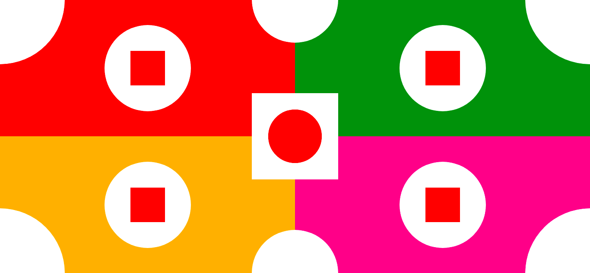
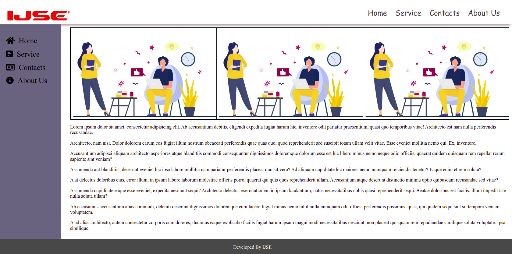

# CSS ASSIGNMENTS

#### Assignment 1
***Use only Absolute and Relative Positions to implement this design***

#### Assignment 2
***Use only Absolute,Relative and Box-Model to create this design***

#### Assignment 3
***Use only Absolute,Relative and Fixed positions***

#### Assignment 4
***Use only Absolute,Relative and Sticky positions to create this design***

#### Assignment 5 & Assignment 6
***Use transitions and key-frames to implement this Animations.***

#### Assignment 7 
***Basic rotation with animation.***

#### Assignment 8
***Create image slider from using CSS animations.***

#### Assignment 9
***Create animation for a loader which look like a Water Drop.***

#### Assignment 10
***Car Animation***

